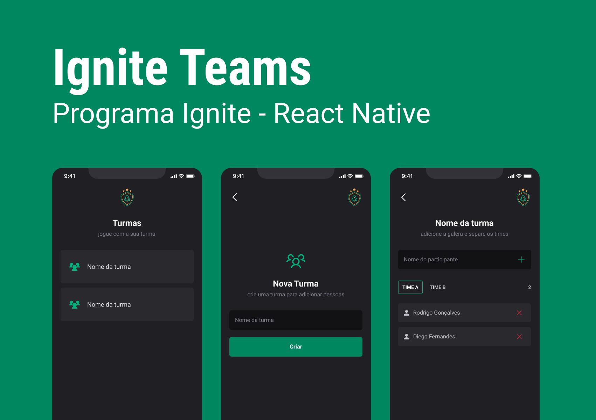

<p align="center">
  
</p>

## **💻** Projeto

Organizar a galera e jogar no final de semana…

Para aprofundar ainda mais meus conhecimentos sendo alinhado com as novas e melhores práticas e tecnologias disponíveis no mundo da tecnologia, desenvolvi a aplicação mobile “Ignite Teams” durante o programa de aceleração “Ignite - React Native”, onde contruímos um sistema de lista de presença, onde é possível adicionar e remover jogadores, adicionar grupos e times, utilizando tecnologias como React, React Hooks, expo, e um design system próprio criado em Styled Component, um CSS-in-JS usado para estilização.

 <p align="center">
  
</p>


## Tecnologias utilizadas

- [Expo](https://expo.dev/)
- [Typescript](https://www.typescriptlang.org/)
- [ReactJS](https://pt-br.reactjs.org/)
- [phosphor-react-native](https://www.npmjs.com/package/phosphor-react-native)
- [react-native-safe-area-context](https://www.npmjs.com/package/react-native-safe-area-context)
- [expo-google-fonts/roboto](https://www.npmjs.com/package/@expo-google-fonts/roboto)
- [react-navigation/native-stack](https://reactnavigation.org/docs/native-stack-navigator/)
- [react-native-async-storage/async-storage](https://www.npmjs.com/package/@react-native-async-storage/async-storage)


## **🔖 Layout**

Você pode visualizar o layout utilizado através do link abaixo:

- [Layout](https://www.figma.com/file/o410njqkDFdPQO8VrQhc9t/Ignite-Teams-(Community)?node-id=37%3A6)

## **🚀** Como Executar

Antes de baixar o projeto você vai precisar ter instalado na sua máquina as seguintes ferramentas:

- [Git](https://git-scm.com/)
- [NodeJS](https://nodejs.org/en/)
- [NPM](https://www.npmjs.com/)
- [Expo](https://expo.dev/) (para emular na plataforma)

Segue os comandos para baixar e executar o projeto na sua máquina:

```bash
## Clone o projeto em sua máquina
git clone https://github.com/srsouzaj/igniteteams.git

# Acessar o projeto no terminal
$ cd igniteteams

# Instalar as dependências
$ npm install

# Executar o servidor em modo de desenvolvimento
$ npm run start

# Acessar o expo no emulador desejado
```

## 📝 License

Esse projeto está sob a licença MIT. Veja o arquivo [LICENSE](https://github.com/srsouzaj/06-ignite-call/blob/master/LICENSE.md) para mais detalhes.

Feito com ❤️ por Jorge de Souza
